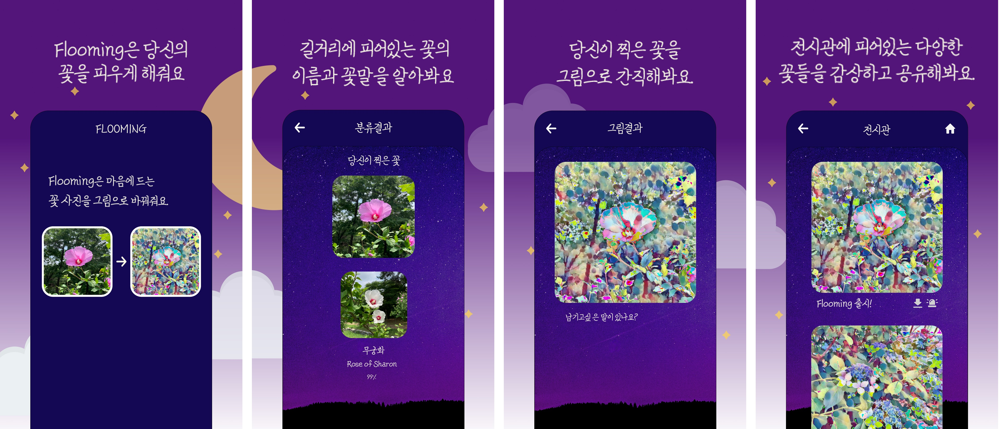

# Flooming-Android



## Description
>딥러닝 모델을 활용한 꽃 사진 분류, 꽃 그림 생성 모바일 앱

## Installation
```npm install```

## Start
```npm start```

## Techs

```React Native```, ```expo-cli```, ```axios```

## Functions
<ul>
  <li>꽃 분류 (28개의 서로다른 꽃 클래스 탑재)</li>
  <li>꽃 사진을 그림으로 변환</li>
  <li>꽃 그림을 comment와 함께 업로드 (전시관)</li>
  <li>변환된 꽃 그림을 디바이스에 저장</li>
  <li>게시글 신고</li>
</ul>

<!-- ## Results -->
